## Team Name
Here for Headout

### Team Members
- [Govind Dixit](https://github.com/GOVINDDIXIT)
- [Rohit Verma](https://github.com/refactor-droidyy)
- [Chetan Joshi](https://github.com/ceejay98)

## Project Name
## Travel Wise

*" find travel buddies - save money ! "*
Travel Wise is an app that helps you find co travellers in your journey. It helps you find people to share your journey with, thus can help you save money spent on travelling. Often cab prices are high and people want to have someone to share travel expenses. This application solves this problem !

## Tech Stack
- Android (Java & Kotlin)
- Firebase 
- Google Place API
- Google Geocoding API
- Ola/Uber SDK Integration

## Build Instruction
- Fork and clone the project using Git
- Open the local version of the project in the Android Studio.
- Create a new project on Google Cloud Console and enable place api and geocoding api for the project and get the API Credentials.
- Enter your API Credentials to the project and run the app.

## Features Of The App 

This application has many features which are useful in many ways. Some of them are

- Secure Firebase Authentication with forgot password functionality.
- User can post to member of his organisation or anonymously to other organisation.
- User can decide the audience which can see the journey request made by him/her.
- Complete chat functionality to chat with the interested user before the journey.
- Live feeds Of journey requests by users at a single place.
- User can accept or cancel the request in the real time
- Companions/Co-travellers slots are real time.
- User can choose his preferred mode Of travel for journey. i.e. Ola, Uber, Train, Flight etc
- User can directly book the **Ola/Uber cab from the app.**
- Emergency button to send the mail to closed ones with live location.
- Track of all journeys made by the user is available at single place.

## Future Vision
- User can search the nearest co travelers by entering his current location.
- User will be notified about their share of the fare.

## Screenshots of the app

<table>
   <tr>
      <td>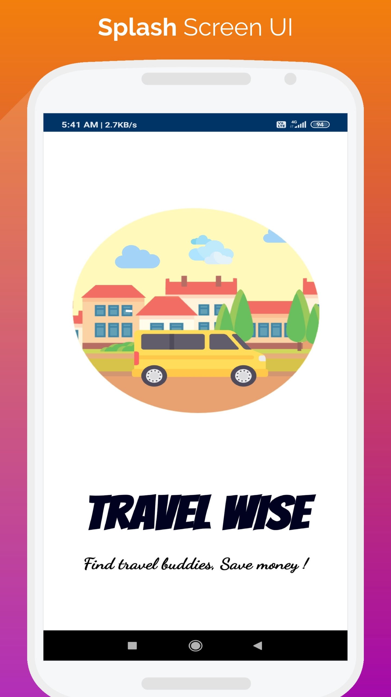</td>
      <td>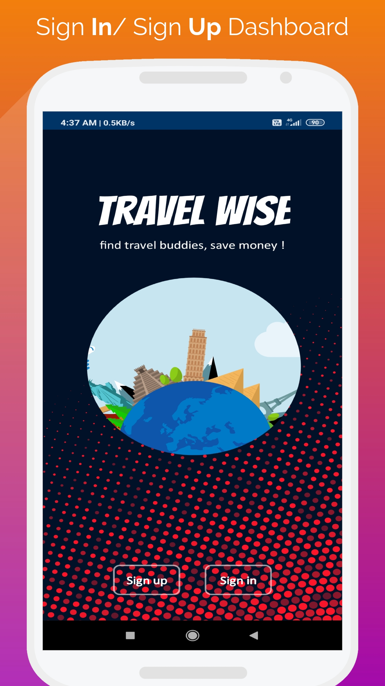</td>
      <td>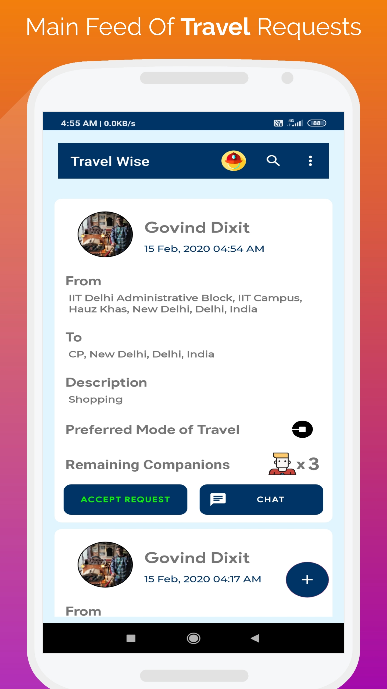</td>
  </tr>
   <tr>
      <td>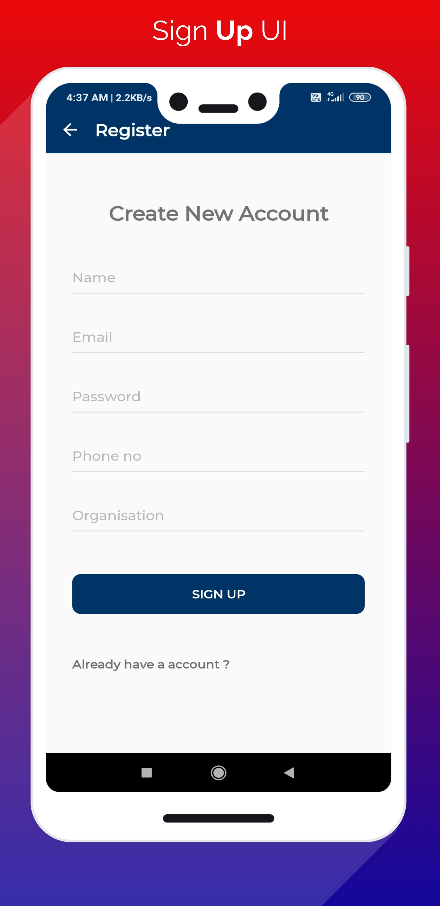</td>
      <td>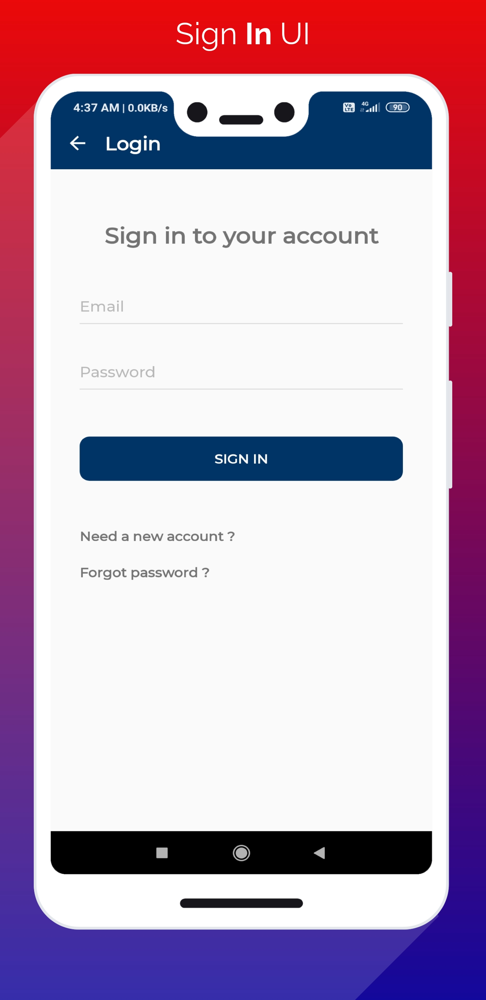</td>
      <td>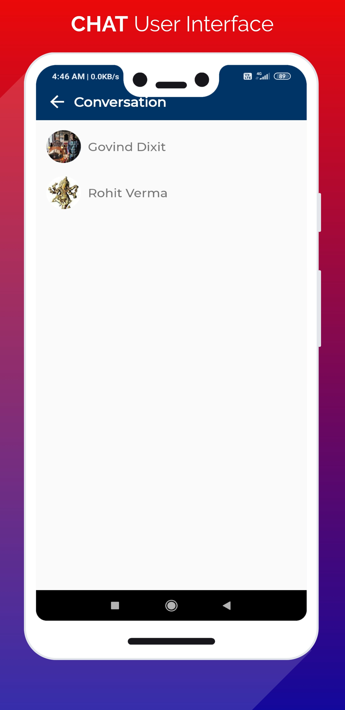</td>
  </tr>
  <tr>
      <td>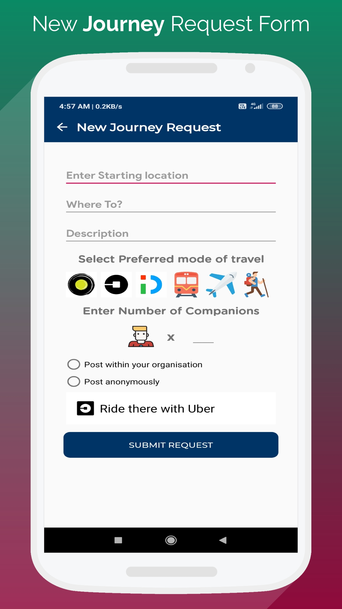</td>
      <td>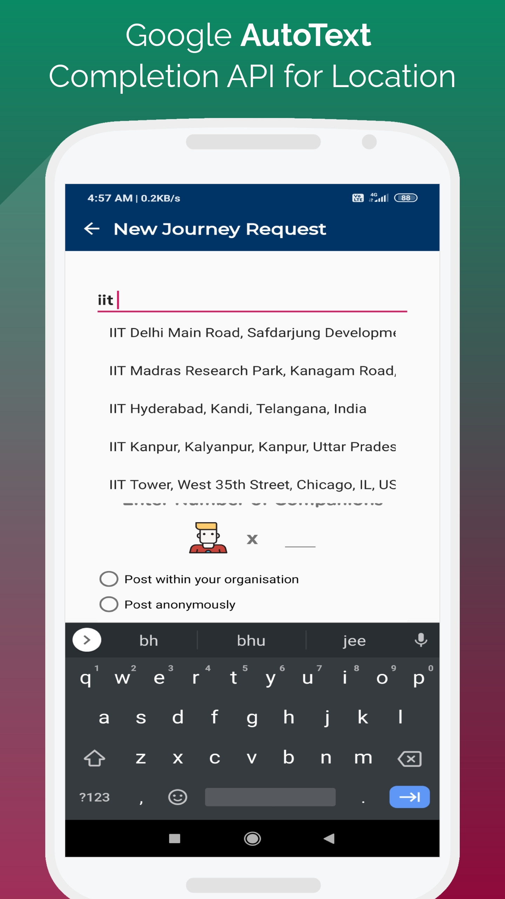</td>
      <td>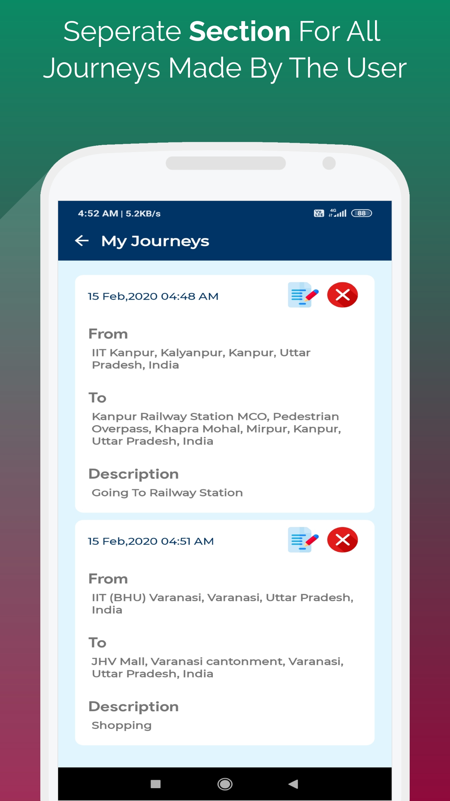</td>
  </tr>
  <tr>
      <td>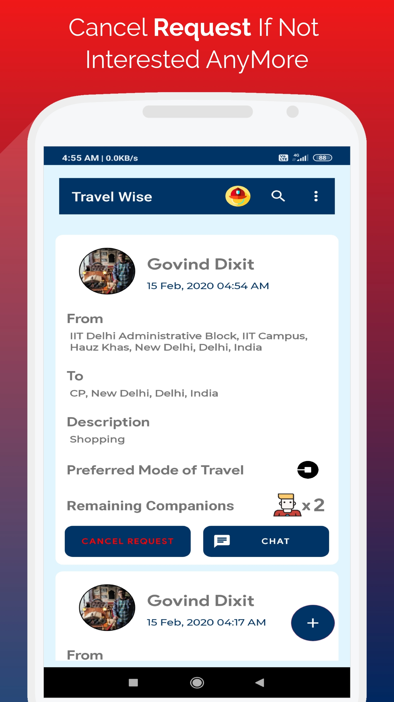</td>
      <td>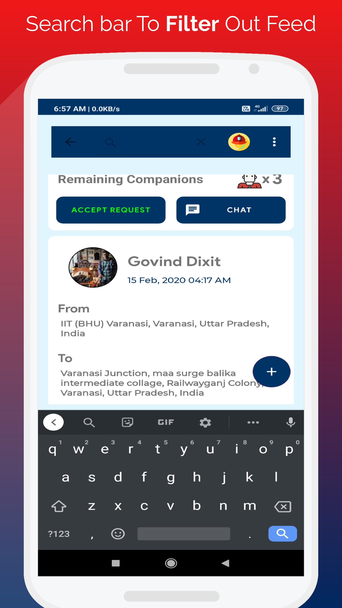</td>
      <td>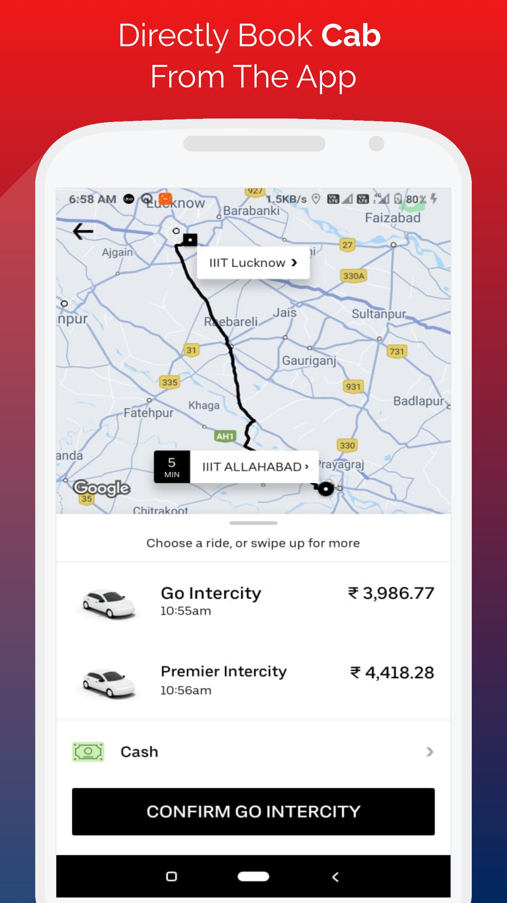</td>
  </tr>
</table>
